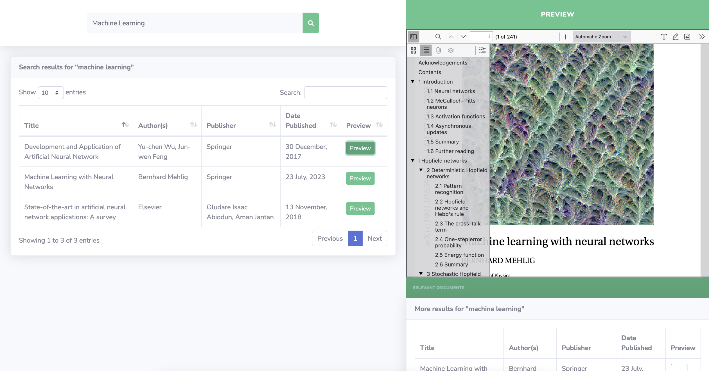
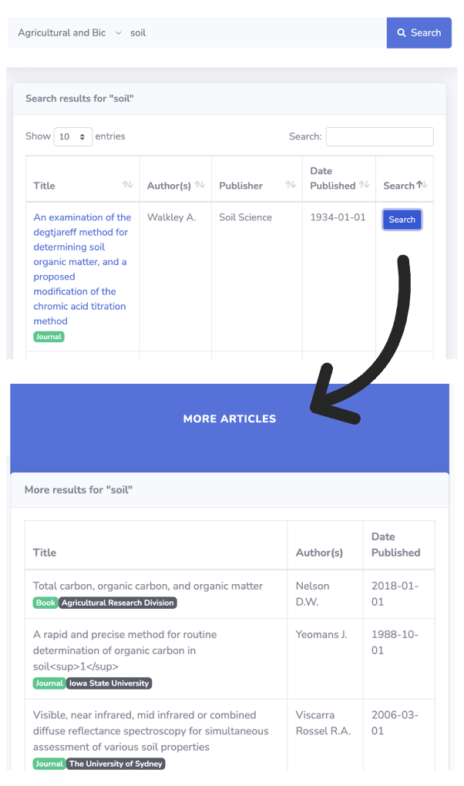

# LLM Induced Semantic Search Engine for Academic Articles

This project focuses on developing a semantic search engine tailored for academic articles. By leveraging Large Language Models (LLMs) like BERT, Vicuna, and Llama, the search engine enhances the search capabilities beyond traditional keyword-based methods. The engine is designed to better understand user queries and retrieve more contextually relevant academic papers.

## Key Features
- **LLM Integration**: Utilizes advanced language models (BERT, Vicuna, Llama) to improve semantic understanding and query expansion for more accurate search results.
- **Query Processor**: Processes user queries with stop-word removal, stemming, and normalization to enhance search performance.
- **Keyword Generator**: Employs LLMs to generate relevant keywords for academic articles, improving the precision of search results.
- **Database**: Integrates with Scopus.com to retrieve and store academic papers for training the search engine.
- **Ranker**: Ranks search results based on semantic similarity, popularity, and relevance to the user's query.
- **Web Interface**: Provides a user-friendly web interface for searching academic articles, complete with filtering options and a re-search functionality for refining search results.

## How to Use
1. **Enter a Query**: Use the search bar to input your academic query.
2. **View Results**: Browse through the ranked list of academic articles retrieved based on your search.
3. **Filter Results**: Refine your search with additional filters like author name, publication date, and more.

4. **Re-Search**: Use the re-search functionality to find documents related to a specific article in the search results.

## Technologies Used
- **Programming Languages**: Python, JavaScript (for front-end)
- **Libraries**: BERT, Vicuna, Llama (for NLP), D3.js, Sencha.js (for visualization)
- **Database**: Scopus API integration for academic papers
- **Frameworks**: Node.js (for backend), Bootstrap (for front-end)
- **Tools**: Cosine Similarity, Jaccard Coefficient, WordNet for relevance scoring

## Project Team
- **Jaspreet Chowdhary (Leader)** - jaspreet@vt.edu
- **Chaitanya Kanakamedala** - venkatachaitanya@vt.edu
- **Sourav Mondal** - sourmon@vt.edu

## Future Enhancements
- **Global Search**: Expand the search engine to include multiple academic databases like PubMed, IEEE Xplore, and Google Scholar.
- **Additional Features**: Incorporate more advanced NLP techniques and visualization tools to further improve search accuracy and user experience.

This project aims to streamline the academic research process by providing a more intelligent and contextually aware search engine, leveraging the latest advancements in large language models.
